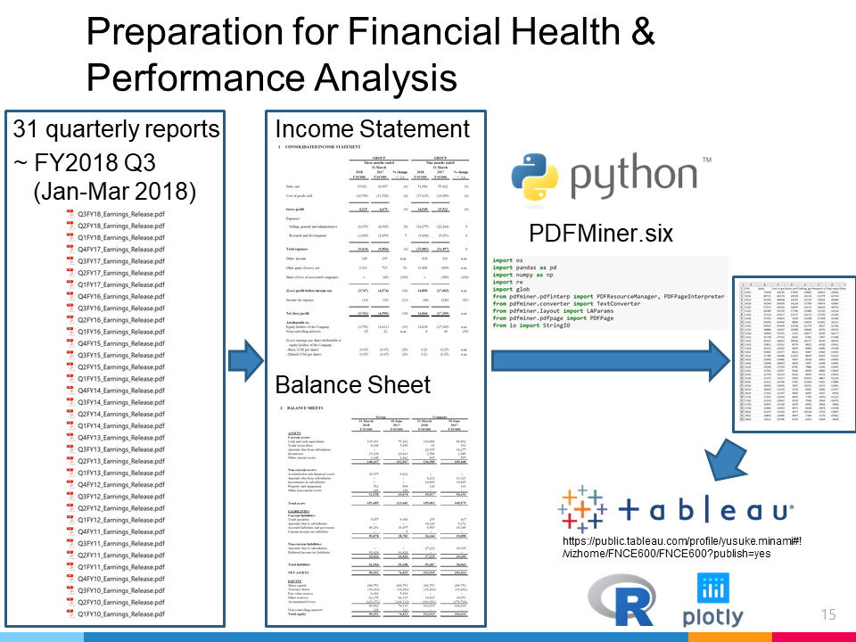

# scrape-pdf-financial-reports

	

The Python code to scrape PDF financial reports from Creative Technology is available at:
https://colab.research.google.com/github/Minyus/scrape-pdf-financial-reports/blob/master/Scrape_Quarterly_Reports.ipynb

The scraped financial reports were visualized as a Tableau dashboard at: https://public.tableau.com/profile/yusuke.minami#!/vizhome/FNCE600/FNCE600

Data sources:
- Quarter reports (Q1 FY2010 to Q3 FY2018) downloaded from https://www.creative.com/corporate/investor/releases.aspx
- Historical Stock price downloaded from https://sg.finance.yahoo.com/quote/C76.SI/history?period1=946656000&period2=1530547200&interval=1d&filter=history&frequency=1d

